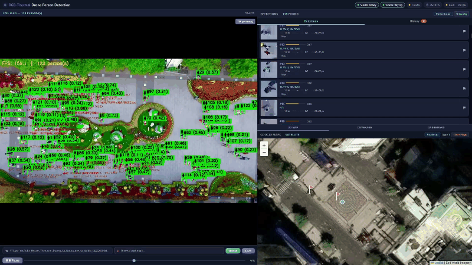
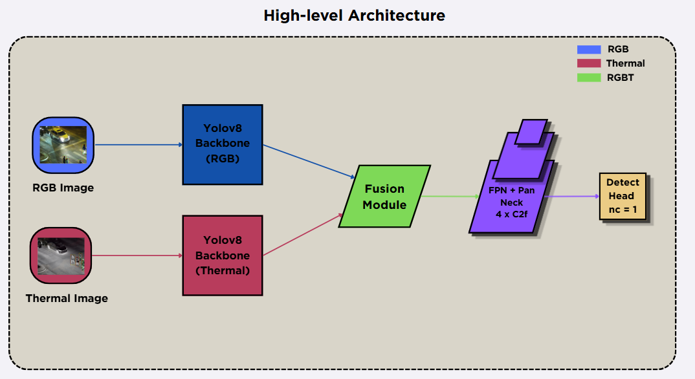
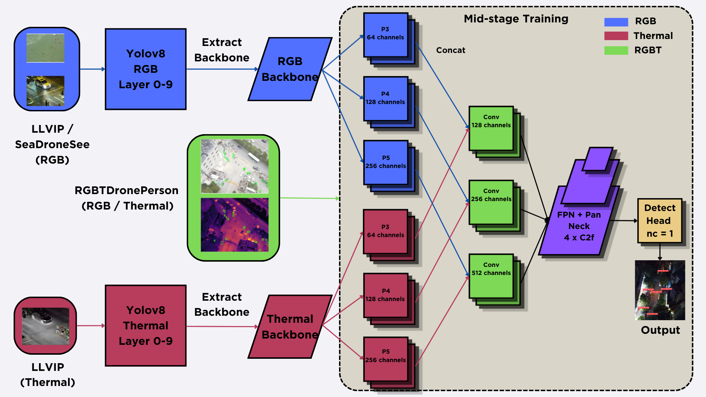
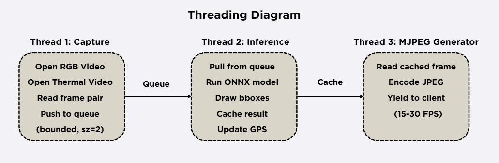

# RGB-Thermal Fusion for Drone Person Detection


Multi-modal person detection system that fuses **RGB and thermal imagery** from drones for search-and-rescue operations. We systematically compare three fusion strategies (early, mid, late) built on dual YOLOv8-nano backbones and demonstrate that **mid-stage progressive fusion** achieves the best precision-recall balance on the [RGBTDronePerson](https://github.com/RGBTDronePerson) benchmark. The system includes real-time GPS geo-localization of detected persons using drone telemetry.

> **Paper (PDF):** [`paper/Paper.pdf`](paper/Paper.pdf)
> **Reference:** Zhang et al., *"Drone-based RGBT tiny person detection"*, ISPRS J. Photogrammetry & Remote Sensing, 2023 - [DOI](https://doi.org/10.1016/j.isprsjprs.2023.08.016)

---

## Demo

<!-- Replace with your actual demo GIF (5-10s screen recording of the web app running detection) -->
<!-- To create: run the demo, screen-record 5-10s, convert to GIF with: ffmpeg -i demo.mp4 -vf "fps=10,scale=800:-1" -loop 0 docs/demo.gif -->

<p align="center">
  
  <br>
  <em>Real-time person detection from drone footage with GPS overlay (placeholder - see Quick Start to run locally)</em>
</p>

---

## Architecture

We compare three fusion strategies, each using two frozen YOLOv8-nano backbones pretrained on LLVIP (nightvision) and SeaDronesSee (maritime drone) datasets:

<p align="center">
  
</p>

| Strategy | Approach | Fusion Point |
|----------|----------|-------------|
| **Early** | Concatenate RGB+Thermal as 4-channel input, single backbone | Before feature extraction |
| **Mid-stage** | Two backbones extract P3/P4/P5 features independently, fuse via learnable modules | Intermediate feature maps |
| **Late** | Two independent YOLO detectors, merge predictions via Weighted Boxes Fusion | Output bounding boxes |

### Mid-Stage Fusion (Best)

<p align="center">
  
</p>

Three mid-stage variants were evaluated:

- **Baseline** - Concat + Conv1x1 reduction
- **Progressive** - Three-stage curriculum: frozen backbones -> gradual unfreezing with increasing LR
- **QFDet** - Quality-aware fusion with pool-upsample and cross-modality attention weights

---

## Results

Evaluated on [RGBTDronePerson](https://github.com/RGBTDronePerson) validation set (1,207 image pairs). Each configuration trained with 3 random seeds (42, 777, 123); values below are mean ± std.

| Method | Backbone Config | mAP@0.5 | mAP@[.5:.95] | Precision | Recall |
|--------|----------------|:-------:|:-----------:|:---------:|:------:|
| **Mid-Progressive** | **LLVIP + LLVIP** | **57.72 ± 1.6** | **19.55 ± 0.5** | **66.1** | **56.3** |
| Mid-Progressive | SDS + LLVIP | 56.70 ± 1.8 | 18.86 ± 0.9 | 65.8 | 54.0 |
| Mid-ProgQFDet | SDS + LLVIP | 55.96 ± 1.5 | 18.57 ± 0.9 | 64.9 | 52.9 |
| Mid-Baseline | SDS + LLVIP | 53.60 ± 0.5 | 17.70 ± 0.2 | 64.6 | 50.6 |
| Late Fusion (WBF) | LLVIP + LLVIP | 52.20 | 17.78 | 83.9 | 12.2 |
| Mid-QFDet | LLVIP + LLVIP | 51.86 ± 1.1 | 17.14 ± 0.6 | 62.0 | 50.4 |
| Early Fusion (4ch) | LLVIP | 25.37 | 8.32 | 43.6 | 28.1 |

After fine-tuning the best model on custom drone data (NTUT + local footage):

| Dataset | mAP@0.5 | mAP@[.5:.95] | Precision | Recall |
|---------|:-------:|:-----------:|:---------:|:------:|
| RGBTDronePerson (before) | 59.04 | 20.04 | 68.2 | 54.4 |
| Custom drone test (after) | **85.07** | **41.32** | **89.4** | **78.5** |

### Benchmark - Inference Speed

Tested on the demo web application with a single RGB-Thermal video pair:

| Backend | Hardware | FPS | VRAM | Notes |
|---------|----------|:---:|:----:|-------|
| ONNX Runtime (FP32) | RTX 4070 Super 12GB | ~45 | 1.2 GB | Recommended for demo |
| ONNX Runtime (FP32) | CPU (i7-13700K) | ~8 | - | No GPU required |
| PyTorch (FP32) | RTX 4070 Super 12GB | ~30 | 3.8 GB | Full mid-fusion model |

> Inference includes preprocessing, dual-backbone forward pass, fusion, NMS, and GPS estimation.
> Batch size = 1. Image size = 640x640.

---

## Project Structure

```
.
├── notebooks/
│   ├── backbones/           # Backbone pretraining (LLVIP, SeaDronesSee)
│   ├── eda/                 # Exploratory data analysis
│   ├── mid_stage/           # Mid-fusion training (8 notebooks)
│   ├── late_stage/          # Late-fusion training (WBF)
│   ├── early_stage/         # Early-fusion training (4-channel)
│   ├── finetune/            # Fine-tuning on custom drone data
│   └── train_common.py      # Shared training utilities (860 lines)
├── src/
│   └── Demo/
│       ├── app.py           # FastAPI web server (producer-consumer architecture)
│       ├── inference.py     # ONNX / PyTorch inference + GPS estimation
│       ├── telemetry.py     # DJI flight record polling via ADB
│       └── static/          # Web frontend (Leaflet.js map + MJPEG viewer)
├── weights/                 # Pretrained backbones (not tracked in git)
├── docs/figures/            # Architecture diagrams
├── Dockerfile
├── requirements.txt
└── README.md
```

---

## Model Weights

Pre-trained ONNX model is hosted on Hugging Face (not included in this repo due to file size):

| Model | Size | Dataset | Download |
|-------|------|---------|----------|
| Progressive Mid-Fusion (ONNX, FP32) | ~25 MB | RGBTDronePerson + NTUT | [Hugging Face](https://huggingface.co/hiungn/RGBT-Fusion-Drone-SAR) |

```bash
# Download and place in src/Demo/models/
mkdir -p src/Demo/models
# Download fusion_progressive_s2.onnx from the link above into src/Demo/models/
```

> Update the link above once the Hugging Face repository is ready.

---

## Quick Start

### Option 1: Docker (demo only, no GPU required)

```bash
git clone https://github.com/hiungn/RGBT-Fusion-Drone-SAR.git
cd RGBT-Fusion-Drone-SAR

docker build -t rgbt-fusion .
# Place your ONNX model in src/Demo/models/ first
docker run -p 8000:8000 -v $(pwd)/src/Demo/models:/app/src/Demo/models rgbt-fusion
```

Open `http://localhost:8000` and upload a drone video to see detection results with GPS overlay.

### Option 2: Local environment

```bash
# Create environment
conda create -n rgbt python=3.10 -y && conda activate rgbt
pip install -r requirements.txt

# For demo only (lightweight, no PyTorch)
pip install -r src/Demo/requirements.txt

# Run demo
cd src/Demo && uvicorn app:app --host 0.0.0.0 --port 8000
```

### Training (requires GPU)

```bash
# Place datasets in data/RGBTDronePerson/ and backbone weights in weights/backbones/
# Open any notebook in notebooks/mid_stage/ and run all cells
jupyter notebook notebooks/mid_stage/Mid_Progressive_Stream2.ipynb
```

---

## Datasets

| Dataset | Purpose | Size | Source |
|---------|---------|------|--------|
| [RGBTDronePerson](https://github.com/RGBTDronePerson) | Main training & evaluation | 6,125 RGB-Thermal pairs | Zhang et al., 2023 |
| [LLVIP](https://bupt-ai-cz.github.io/LLVIP/) | Backbone pretraining (nightvision) | 15,490 visible-infrared pairs | Jia et al., 2021 |
| [SeaDronesSee](https://seadronessee.cs.uni-tuebingen.de/) | RGB backbone pretraining | 14,227 drone images | Varga et al., 2022 |
| [NTUT AIoT](https://www.aiotlab.org/) | Fine-tuning (4K drone footage) | 4,095 frames | Lai et al., 2023 |

---

## Training Details

- **Base model:** YOLOv8-nano (3.2M parameters) with dual frozen backbones
- **Optimizer:** AdamW with warmup + cosine annealing (LR: 1e-5 -> 5e-4)
- **Progressive unfreezing:** Stage 1 (frozen, 5 ep) -> Stage 2 (unfreeze 3 layers, 10 ep) -> Stage 3 (full unfreeze, cosine decay, patience=2)
- **Augmentation:** Horizontal flip (p=0.5), Gaussian blur on RGB only (p=0.5)
- **Loss:** YOLOv8 detection loss (box + cls + DFL), normalized per batch
- **Evaluation:** COCO-style AP with 101-point interpolation, IoU [0.5:0.05:0.95]
- **Seeds:** 42, 777, 123 with early stopping (patience=2)
- **GPU:** NVIDIA RTX A5000 (24 GB)

---

## Demo System Architecture

<p align="center">
  
</p>

The demo web app uses a multi-threaded producer-consumer design:

- **Capture thread:** Reads frames from uploaded video or live phone screen (via ADB/scrcpy)
- **Inference thread:** Runs ONNX model on RGB-Thermal frame pairs, estimates GPS coordinates
- **Stream generator:** Encodes annotated frames as MJPEG for browser display
- **Telemetry thread:** Polls DJI flight records via ADB for real-time drone GPS/attitude

GPS estimation uses camera intrinsics (FOV-based) and ray-ground intersection to project pixel coordinates to geographic coordinates.

---

## Third-Party Licenses

This project uses the following open-source libraries:

| Library | License | Usage |
|---------|---------|-------|
| [Ultralytics YOLOv8](https://github.com/ultralytics/ultralytics) | AGPL-3.0 | Backbone architecture, detection head |
| [ONNX Runtime](https://github.com/microsoft/onnxruntime) | MIT | Inference engine for demo |
| [FastAPI](https://github.com/tiangolo/fastapi) | MIT | Web server |
| [ensemble-boxes](https://github.com/ZFTurbo/Weighted-Boxes-Fusion) | MIT | WBF for late fusion |
| [Leaflet.js](https://leafletjs.com/) | BSD-2 | Map visualization |

---

## Citation

If you find this work useful, please cite:

```bibtex
@thesis{gsp26ai03_2026,
    title     = {RGB-Thermal Fusion-Based Human Detection and Geo-Localization
                 Using Drones for Search-and-Rescue},
    author    = {Le, Tu Quoc Huy and Vu, Hoang Minh Khanh and
                 Mai, Quang Khai and Nguyen, Trong Hieu},
    school    = {FPT University, Ho Chi Minh City},
    year      = {2026},
    type      = {Bachelor's Thesis},
    note      = {Course AIP491, Group GSP26AI03}
}
```

Reference paper:

```bibtex
@article{zhang2023drone,
    title   = {Drone-based RGBT tiny person detection},
    author  = {Zhang, Yan and others},
    journal = {ISPRS Journal of Photogrammetry and Remote Sensing},
    volume  = {204},
    pages   = {61--76},
    year    = {2023},
    doi     = {10.1016/j.isprsjprs.2023.08.016}
}
```

---

## License

This project is licensed under the [Apache License 2.0](LICENSE).
Note: The Ultralytics YOLOv8 dependency is licensed under AGPL-3.0. See [Third-Party Licenses](#third-party-licenses) for details.
